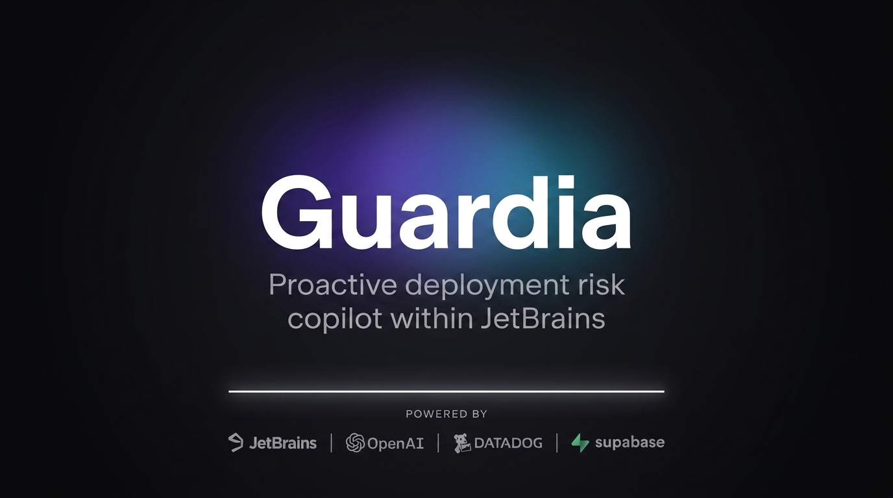

# Guardia — Proactive Deployment Risk for JetBrains IntelliJ

**The SRE co-pilot that lives in your JetBrains IDE.** Guardia surfaces deployment risk inside the editor — *before* you merge, *before* you deploy — by pairing your Datadog incident history and release cadence with an OpenAI Codex agent loop grounded in that data.

Tags: **`JETBRAINS`** · `OPENAI` · `CODEX` · `DATADOG` · `SUPABASE` · `SRE`

Cerebral Valley "IDE Reimagined" — **Category 3: Reviewing & Deploying Code** · JetBrains × OpenAI · April 18–19, 2026.

---

## 1. The problem — deployment risk is hiding in plain sight

Every engineering team lives the same four-act tragedy:

1. A PR looks clean in review.
2. It merges and deploys.
3. Datadog lights up.
4. The post-mortem concludes with *"we'd seen this pattern before."*

The signal was always there — in Datadog's incident history, in the error-rate delta on the touched service, in the specific snippet that broke production six weeks ago. It just never reached the place where the decision to merge gets made: the IDE.

**Today's tools each own one piece:** Datadog owns runtime data but lives in a separate tab. Copilot and Cursor know the code but not the runtime. GitHub PR checks gate bad merges only after you push. None of them surface production risk *while a developer is writing the diff.*

**The unoccupied ground:** deployment risk, visible at the cursor.

### What Guardia delivers (Category 3: Reviewing & Deploying Code)

Before a developer hits merge, they see:

- Which touched services are currently on fire in Datadog
- Which past incidents the diff resembles — cited by incident ID
- A bounded 0–100 risk score from deterministic heuristics + causal AI reasoning
- A one-click Apply Fix when the cited incident has a known resolution

The IntelliJ Platform already owns the cursor, the project model, the VCS view, the settings surface, and the local-history timeline. Guardia is what happens when production risk finally lives inside those surfaces.

---

## 2. Sponsor integrations & architecture

Four sponsor technologies, each doing work no other integration could cleanly replace.

### 🟣 JetBrains — the surface

Guardia is a native IntelliJ Platform plugin, built on IntelliJ Platform Gradle Plugin 2.14.0 against IDEA 2025.2.6.1 on JDK 21. It uses PSI for code traversal, Git4Idea for diff extraction, `PasswordSafe` for OS-keychain credential storage, and `WriteCommandAction` for undoable patching — so every surface looks, feels, and behaves like a first-party JetBrains feature in Darcula, Light, and High-Contrast alike.

### 🟢 OpenAI — the reasoning

The risk-analysis core is an **OpenAI Responses API agent loop** with six registered tools, shipped on **`gpt-5-codex`** — purpose-built for agentic code reasoning. The agent receives the diff and the deterministic baseline score, iterates tool calls until it has enough evidence, and terminates by emitting a bounded ±25 override with a citation to at least one real incident ID. Hallucinated IDs are rejected and the agent is re-prompted. Typical loop: 3–8 seconds.

### 🟠 Datadog — the data

Guardia reads incident history and service health from Datadog, and writes plugin-generated risk events back into the Datadog Events Explorer so everything stays queryable alongside normal telemetry.

### 🟦 Supabase — the team memory

Every Apply Fix click fires a remediation event to a Supabase PostgREST table — anon key with Row-Level Security, off-EDT, graceful no-op if unconfigured. Individual judgment doesn't scale; shared remediation data does. Over time the team sees which incidents are recurring, which fixes land, and which services are hot.

---

## 3. How we proactively detect deployment risk

Guardia's risk score is **hybrid by design** — a deterministic Kotlin floor plus a bounded AI override.

### Layer 1 — deterministic baseline

A weighted Kotlin formula scores the PR on six factors, grounded in data the IDE can read locally:

- Error-rate delta on the touched services since the last commit
- Whether the touched services are in today's deploy window
- Blast radius (direct-dependency count)
- Change velocity on those services over the last week
- File-level churn on the touched files
- Recency of historical incidents matching the diff

Runs in under 5 ms, clamped 0–100, never fails. The AI layer can't override it into silence.

### Layer 2 — Codex causal override

The baseline is handed to a Codex agent loop alongside the raw diff and the incident corpus. Codex decides whether the diff *re-introduces* a past failure or *addresses* an open one, and adjusts the score by at most ±25 points with a justification citing at least one incident ID.

The agent is given six tools: diff extraction, per-service Datadog context, hybrid incident retrieval (BM25 + structural + Reciprocal Rank Fusion), baseline recomputation, a substring scan across past offending-code snippets (the novel beat — the agent grep's the *code* that broke, not just the service name), and a terminator that emits final score + citations. The reasoning trace streams live into the tool window as a chip pipeline.

If the live API errors mid-loop, a pre-cached trace takes over silently.

---

## 4. How we fix the risks (remediation)

Detection alone is just better triage. Guardia closes the loop.

When Codex identifies a specific past-incident match, the tool window surfaces a one-click **Apply Fix**:

- **Grounded, not invented.** The patch is derived from the cited incident's resolved-code fingerprint — the actual code that fixed the bug last time.
- **Undoable.** Applied through `WriteCommandAction`, so `Cmd+Z` works and the change appears in Local History.
- **Idempotent.** Content-fingerprint tracking flips the button to "Applied" after a click and auto-resets if the developer reverts manually.
- **Visually confirmed.** A green-flash highlight pulses on the touched lines.
- **Logged to the team.** Supabase records `{incident_id, target_method, outcome, rationale, timestamp}` off-EDT.

Deployment risk detected → explained with citations → fixed with one click → logged for team learning. All without leaving the editor.

---

## 5. Deployment history, side-by-side with the code

The past lives next to the diff:

- **Matched incident card.** Title, severity, root cause, resolution date. One click opens the Datadog Events Explorer on the exact tag set.
- **Code comparison.** Past offending snippet next to the current diff fragment, same font, same width.
- **Live feed.** Events tied to current risk signals, each linked to the source line and to Datadog.
- **Methods-at-risk inbox.** Known-risky methods in the current project, auto-expanded on file open.
- **Editor highlights.** Offending lines pulse, then keep a persistent underline with a hover citation.

---

## Stack

- **Languages:** Kotlin (plugin), Python (fixture generation & Datadog ingest), Java (demo target compatibility)
- **Platform:** IntelliJ Platform SDK 2025.2.6.1 via IntelliJ Platform Gradle Plugin 2.14.0, Gradle 9.4, JDK 21
- **APIs consumed:** OpenAI Responses API, Datadog Incidents + Events API, Supabase PostgREST
- **Distribution:** Packaged IntelliJ plugin `.zip`, installable on IDEA 2025.2+ across macOS, Linux, Windows

---

**Get started:** `cp .env.example .env`, set `OPENAI_API_KEY`, run `./gradlew runIde`. Architectural depth in [`ARCHITECTURE.md`](ARCHITECTURE.md); demo flow in [`DEMO.md`](DEMO.md).
